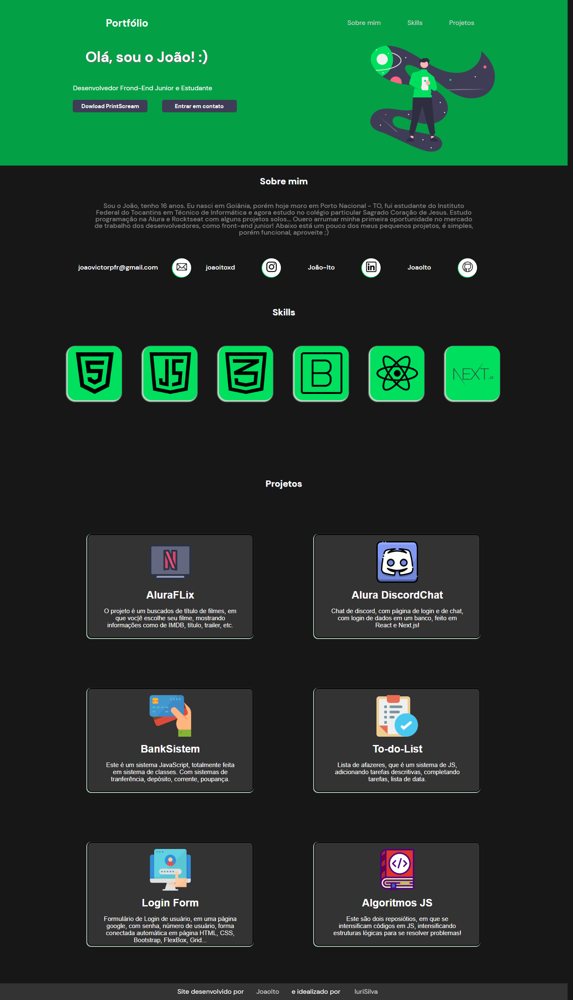
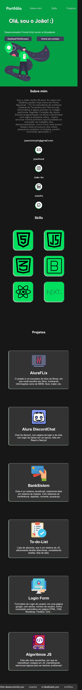

# Joaovictorpfr.com 👨🏻‍💻

<h3>Finalmente criei o meu site pessoal, espero que gostem! Ele mostra um pouco da minha vida, e deixa uma parte dos meus contatos, contando ainda com alguns projetos que adicionarei para vizualização, no futuro...</h3>

O site é um portfólio pessoal onde conto um pouco mais de onde vim e oque eu faço hoje em dia, e oque tem me levado o mundo da programação na busca do primeira oportunidade no mercado! dentre os projetos estão todos listados já no próprio perfil do GitHub e também linkados os principais no site, veja lá!
Ele ainda está bem simples e sucinto. Irei adicionando no futuro, e assim fazendo atualizações de acordo com meus estudos e irei implementando novas funcionalidas, por já, adicionarei logo logo ele no ar...

# 
## Versão desktop 

# 
## Versão mobile 

#

## Projetos principais:

## AluraFlix 
<a href="https://github.com/JoaoIto/AluraFlix">AluraFlix</a>
é projeto é um buscados de título de filmes, em que voc|ê escolhe
                                seu
                                filme, mostrando informações como de IMDB, título, trailer, etc.

# 
## AluraCord 
<a href="https://github.com/JoaoIto/alura_discord">AluraCord</a>
Chat de discord, com página de login e de chat, com login de dados
                                em um banco, feito em React e Next.js!
                                
#

## Bank 
<a href="https://github.com/JoaoIto/BankSistem">Bank</a> Este é um sistema JavaScript, totalmente feita em sistema de
                                classes. Com sistemas de tranferência, depósito, corrente, poupança.

#

## To-do-List 
<a href="https://github.com/JoaoIto/To-do-List">ToDoList</a> Lista de afazeres, que é um sistema de JS, adicionando tarefas
                                descritivas, completando tarefas, lista de data.

#

## LoginForm 
<a href="https://github.com/JoaoIto/LoginForm">LoginForm</a> Formulário de Login de usuário, em uma página google, com senha,
                                número de usuário, forma conectada automática em página HTML, CSS, Bootstrap, FlexBox,
                                Grid...
#

## Algoritmos 
<a href="https://github.com/JoaoIto/algorithms">Algoritmos</a> são dois repositórios, em que se intensificam códigos em JS,
                                intensificando estruturas lógicas para se resolver problemas!

#